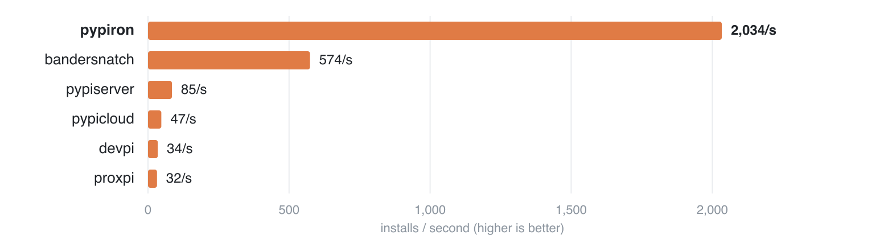

#  pypiron

[](https://github.com/blackthorn-interstellar/pypiron/actions/workflows/ci.yml)
[](https://pypi.org/project/pypiron/)
[](LICENSE)
[](https://pypiron.com/)

An ultra-fast Python package server, written in Rust.

One binary, no database. pypiron serves your private uploads, mirrors public PyPI
on demand, and bulk-syncs allowlists — all behind one URL and one namespace.

**Documentation:** <https://pypiron.com/>

<p align="center">
  
</p>

## Highlights

- **Handles 4–60× more load** than other PyPI servers.
- **Dead simple.** `uvx pypiron serve` and you're live — no database, no config.
- **Works with the whole ecosystem.** uv, pip, poetry, twine, pipenv, hatch.
- **Private and public together.** One URL serves your private packages and
  caches public dependencies from PyPI on first use.
- **Dependency-confusion defense.** Every name is exclusively private or
  mirrored, claimed at first write — private names never fall through to upstream.
- **Horizontal scaling that just works.** Point any number of nodes at one S3
  bucket; reads need zero coordination and failover is automatic.
- **Download tracking.** Per-package, per-version counts at
  `GET /stats/downloads/<pkg>`; per-project labels in Prometheus `/metrics`.
- **Supply-chain quarantine.** Hide releases younger than a window with
  `--exclude-newer`; `uv --exclude-newer` resolves against it.

## Quickstart

```bash
# 1. Start a server (serves http://localhost:8080)
uvx pypiron serve --admin-pass "$ADMIN"

# 2. Publish
uv publish --publish-url http://localhost:8080/legacy/ \
  --username admin --password "$ADMIN" dist/*

# 3. Install
uv add --index http://localhost:8080/simple/ acme-widgets
```

Setting a password enables a role: with only `--admin-pass`, writes need the
admin credential and reads stay public. The pip/twine equivalents and the
guided version are in [First steps](docs/getting-started/first-steps.md).

## Going further

- [Host private packages](docs/guides/private-packages.md)
- [Private + public from one index](docs/guides/private-and-public.md)
- [Air-gapped mirror](docs/guides/air-gapped-mirror.md)
- [Production — S3, multi-node, HTTPS](docs/guides/production.md)
- [Configuration](docs/reference/configuration.md) — every flag and its `PYPIRON_*` env var
- [Benchmarks](docs/reference/benchmarks.md) — how the numbers above were measured

## Alternatives

For comparison:
[bandersnatch](https://github.com/pypa/bandersnatch),
[pypiserver](https://github.com/pypiserver/pypiserver),
[pypicloud](https://github.com/stevearc/pypicloud),
[devpi](https://www.devpi.net/),
[proxpi](https://github.com/EpicWink/proxpi).

## License

MIT — see [LICENSE](LICENSE).
