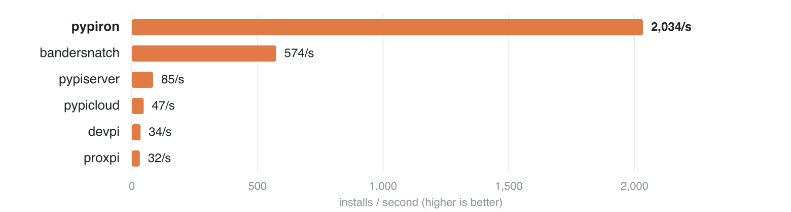

#  pypiron

[](https://github.com/blackthorn-interstellar/pypiron/actions/workflows/ci.yml)
[](https://pypi.org/project/pypiron/)
[](LICENSE)
[](https://pypiron.com/)

An ultra-fast Python package server, written in Rust.

pypiron is the fastest, most reliable PyPI server (and mirror) available.

<p align="center">
  
</p>

- **5–90× faster than any PyPI server.** 3,026 installs/s on 2 vCPU.
- **So robust a single server could handle all of PyPI's traffic.** PyPI averages ~100,000 requests/s — about 7,700 installs/s — and one 8-vCPU c7i.2xlarge clears that at pypiron's measured ~1,500 installs/s per vCPU.
- **Supply-chain quarantine, on by default.** New releases wait 7 days. Most attacks surface first.
- **Private and public, one URL.** A name is yours or PyPI's, never both. No dependency confusion.
- **Scales to a fleet.** Point any number of nodes at one bucket. No coordination.
- **Works with everything.** uv, pip, poetry, pdm, twine, pipenv, hatch, flit.
- **Download stats built in.**

## Quickstart

```bash
# 1. Start a server (serves http://localhost:8080) — native binary…
uvx pypiron serve --admin-pass "$ADMIN"

# …or in a container (storage at /data, built-in healthcheck):
docker run -p 8080:8080 -e PYPIRON_ADMIN_PASS="$ADMIN" \
  ghcr.io/blackthorn-interstellar/pypiron:latest

# 2. Publish
uv publish --publish-url http://localhost:8080/legacy/ \
  --username admin --password "$ADMIN" dist/*

# 3. Install
uv add --index http://localhost:8080/simple/ acme-widgets
```

Only `--admin-pass` set: writes need the admin credential, reads stay public.
pip, twine, and poetry equivalents: <https://pypiron.com/#quickstart>.

## Going further

- [Setup](docs/guides/setup.md) — private packages, public proxy, sync mirror, S3
- [Configuration](docs/reference/configuration.md) — every flag and its `PYPIRON_*` env var
- [Benchmarks](docs/reference/benchmarks.md) — how the numbers above were measured

## Tested like your supply chain depends on it

Anyone can post a benchmark chart. pypiron is validated end-to-end, adversarially, and continuously — and every claim below links to a check you can run yourself.

- **The whole ecosystem, for real.** Every test run drives the real server over HTTP with eight real clients — uv, pip, poetry, pdm, pipenv, hatch, flit, twine. Not mocks: the [actual tools your team uses](dev/TESTING.md#client-compatibility-matrix).
- **All of PyPI. All of it.** The parsers chew through [every file ever uploaded to PyPI — all 17 million](src/corpus_check.rs) — and match ground truth on each one.
- **Kill -9'd until it's boring.** We kill the server at every step of every write, kill fleet nodes mid-upload, and feed it truncated, corrupted, and hash-mismatched upstream responses. It converges to a consistent, installable state every time ([crash sweep](tests/test_crash_consistency.py), [fleet chaos](tests/test_chaos_fleet.py), [upstream faults](tests/test_chaos_upstream.py)).
- **Fuzzed nightly, audited on every PR.** Coverage-guided fuzzers hammer the parsers that eat attacker-controlled bytes [every night](.github/workflows/fuzz.yml); a new advisory anywhere in the dependency tree [fails the build](.github/workflows/ci.yml).
- **Audited until the findings ran dry.** Fable 5 — Anthropic's frontier model — ran security audit pass after security audit pass until they came back clean. All told, over $7,000 of frontier-model compute (at API list prices) went into building and hardening pypiron.
- **Benchmarks with nothing to hide.** The chart above comes from [published docker-compose rigs](bench/install/) for all five competitors. Re-run it. We'll wait.

## Comparison

Hover a checkmark for the caveat where your Markdown renderer supports it.

| Feature | pypiron | bandersnatch | pypiserver | pypicloud | devpi | proxpi |
| --- | :---: | :---: | :---: | :---: | :---: | :---: |
| Easy setup | <abbr title="Single binary, uvx, or Docker; hosts private packages, mirror sync, and proxy from one server.">✅</abbr> | — | <abbr title="Simple private package host over a local directory.">✅</abbr> | — | — | <abbr title="Simple caching proxy; no private uploads.">✅</abbr> |
| Fast | <abbr title="3,026 real installs/s on 2 vCPU in the benchmark.">✅</abbr> | <abbr title="574 installs/s as a static nginx-served mirror.">✅</abbr> | — | — | — | — |
| Scalable without database | <abbr title="Multi-node against S3, GCS, or Azure Blob; no database.">✅</abbr> | <abbr title="Static mirror tree served by nginx or object storage; no database.">✅</abbr> | — | — | — | — |
| Human-readable package pages | <abbr title="Dashboard, package search, download pages, project pages, and README rendering.">✅</abbr> | — | — | <abbr title="Has a web UI.">✅</abbr> | <abbr title="Has a web UI and README rendering.">✅</abbr> | <abbr title="Has a web UI.">✅</abbr> |
| Download stats | <abbr title="Built-in global and per-package download counters.">✅</abbr> | — | — | — | — | — |
| Disk-backed | <abbr title="Default local disk backend.">✅</abbr> | <abbr title="Writes a static mirror tree to disk.">✅</abbr> | <abbr title="Serves packages from local directories.">✅</abbr> | <abbr title="Supports filesystem package storage.">✅</abbr> | <abbr title="Default serverdir storage on local disk.">✅</abbr> | <abbr title="Disk-backed package cache.">✅</abbr> |
| Cloud-storage-backed | <abbr title="S3, S3-compatible, GCS, and Azure Blob.">✅</abbr> | <abbr title="S3-compatible mirror storage.">✅</abbr> | — | <abbr title="S3, GCS, and Azure Blob package storage.">✅</abbr> | — | — |
| Supports `exclude-newer` | <abbr title="Default 7-day holdback for proxy and sync; also preserves upload time for client-side cutoffs.">✅</abbr> | <abbr title="Mirror-time filtering for static mirrors.">✅</abbr> | — | — | — | — |

Compared with [bandersnatch](https://github.com/pypa/bandersnatch),
[pypiserver](https://github.com/pypiserver/pypiserver),
[pypicloud](https://github.com/stevearc/pypicloud),
[devpi](https://www.devpi.net/), and
[proxpi](https://github.com/EpicWink/proxpi).

## License

MIT — see [LICENSE](LICENSE).
