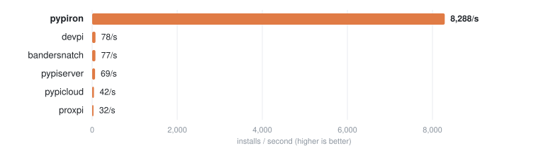

#  pypiron

[](https://github.com/blackthorn-interstellar/pypiron/actions/workflows/ci.yml)
[](https://pypi.org/project/pypiron/)
[](LICENSE)
[](https://pypiron.com/)

An ultra-fast Python package server, written in Rust.

pypiron is the fastest, most reliable PyPI server (and mirror) available.

<p align="center">
  <picture>
    <source media="(prefers-color-scheme: dark)" srcset="docs/assets/install-throughput-dark.svg">
    
  </picture>
</p>

- **100× faster than any PyPI server.** 8,288 verified installs/s on 2 vCPU. ([benchmarks](docs/reference/benchmarks.md))
- **Secure by default.** New releases wait 7 days, known malware never installs, no dependency confusion, air-gap ready. Measured on 2024+ compromises of established PyPI packages: 34% blocked on day 0, 86% with a 30-day cooldown. ([defense](docs/concepts/supply-chain.md))
- **Absurdly well-tested.** [Fuzzing](dev/TESTING.md#fuzzing), [chaos](dev/TESTING.md#chaos-and-crash-consistency), [deterministic simulation](dev/TESTING.md#deterministic-simulation-the-vopr), [model checking](dev/TESTING.md#machine-checked-models-stateright), [real clouds](dev/TESTING.md#real-cloud-backends), [perf](dev/TESTING.md#performance-testing), and [all 17 million files on PyPI](src/corpus_check.rs).
- **Infinite scale.** One 8-vCPU box: PyPI's real index traffic at 200,000 requests/s, p99 under 3 ms. Or any number of nodes on one bucket. ([replay](dev/bench/replay/))
- **Works through outages.** Cross-region, cross-cloud (S3 + GCS + Azure), automatic failover, zero data loss. ([multi-region](docs/guides/multi-region.md))
- **Works with everything.** uv, pip, poetry, pdm, pipenv, hatch, flit, twine.

**Status: beta.** Young project, tested like an old one — run it, break it,
[file issues](https://github.com/blackthorn-interstellar/pypiron/issues).

## Quickstart

<p align="center">
  
</p>

```bash
# 1. Start a server (serves http://localhost:8080) — native binary…
uvx pypiron serve --admin-pass "$ADMIN"

# …or in a container (storage at /data, built-in healthcheck):
docker run -p 8080:8080 -e PYPIRON_ADMIN_PASS="$ADMIN" \
  ghcr.io/blackthorn-interstellar/pypiron:latest

# 2. Publish
uv publish --publish-url http://localhost:8080/legacy/ \
  --username admin --password "$ADMIN" dist/*

# 3. Install
uv add --default-index http://localhost:8080/simple/ acme-widgets
```

Only `--admin-pass` set: writes need the admin credential, reads stay public.
pip, twine, and poetry equivalents: <https://pypiron.com/#quickstart>.

## Going further

- [Setup](docs/guides/setup.md) — private packages, public proxy, sync mirror, S3
- [Configuration](docs/reference/configuration.md) — every flag and its `PYPIRON_*` env var
- [Benchmarks](docs/reference/benchmarks.md) — how the numbers above were measured
- [For AI agents](docs/for-agents.md) — a decision guide, written agent to agent

## Tested like your supply chain depends on it

Anyone can post a benchmark chart. pypiron is validated end-to-end, adversarially, and continuously — and every claim below links to a check you can run yourself.

- **The whole ecosystem, for real.** Every test run drives the real server over HTTP with eight real clients — uv, pip, poetry, pdm, pipenv, hatch, flit, twine. Not mocks: the [actual tools your team uses](dev/TESTING.md#client-compatibility-matrix).
- **All of PyPI. All of it.** The parsers chew through [every file ever uploaded to PyPI — all 17 million](src/corpus_check.rs) — and match ground truth on each one.
- **Kill -9'd until it's boring.** We kill the server at every step of every write, kill fleet nodes mid-upload, and feed it truncated, corrupted, and hash-mismatched upstream responses. It converges to a consistent, installable state every time ([crash sweep](tests/test_crash_consistency.py), [fleet chaos](tests/test_chaos_fleet.py), [upstream faults](tests/test_chaos_upstream.py)).
- **Convergence is machine-checked, not sampled.** A model checker exhaustively verifies the write protocol and the multi-bucket merge over *every* bounded interleaving of writers, workers, crashes, and partition-shaped conflicts — running the same decision functions the server ships, bound by [conformance tests](dev/TESTING.md#machine-checked-models-stateright) so code and model can't drift apart ([the models](tests/model_replication.rs)).
- **A fleet in a bottle, every night.** Deterministic simulation runs a whole multi-node fleet single-threaded on virtual time — on the order of a hundred thousand seeded crash/fault/restart schedules per night, every failure [reproducible from an 8-byte seed](dev/TESTING.md#deterministic-simulation-the-vopr) ([the simulator](examples/vopr.rs)).
- **Fuzzed nightly, audited on every PR.** Coverage-guided fuzzers hammer the parsers that eat attacker-controlled bytes [every night](.github/workflows/fuzz.yml); a new advisory anywhere in the dependency tree [fails the build](.github/workflows/ci.yml).
- **Audited until the findings ran dry.** Fable 5 — Anthropic's frontier model — ran security audit pass after security audit pass until they came back clean. All told, over $7,000 of frontier-model compute (at API list prices) went into building and hardening pypiron.
- **Benchmarks with nothing to hide.** The chart above comes from [published docker-compose rigs](dev/bench/install/) for all five competitors. Re-run it. We'll wait.

## Comparison

Hover a checkmark for the caveat where your Markdown renderer supports it.

| Feature | pypiron | bandersnatch | pypiserver | pypicloud | devpi | proxpi |
| --- | :---: | :---: | :---: | :---: | :---: | :---: |
| Easy setup | <abbr title="Single binary, uvx, or Docker; hosts private packages, mirror sync, and proxy from one server.">✅</abbr> | — | <abbr title="Simple private package host over a local directory.">✅</abbr> | — | — | <abbr title="Simple caching proxy; no private uploads.">✅</abbr> |
| Fast | <abbr title="8,288 verified installs/s on 2 vCPU in the benchmark.">✅</abbr> | <abbr title="77 installs/s as a static nginx-served mirror — NIC-bound on the same box.">✅</abbr> | — | — | — | — |
| Private package hosting | <abbr title="Publish with twine or uv; admin/uploader/reader credentials plus short-lived install tokens.">✅</abbr> | — | <abbr title="Upload endpoint with htpasswd auth.">✅</abbr> | <abbr title="Upload endpoint with access-control lists.">✅</abbr> | <abbr title="Private indexes with per-index access control.">✅</abbr> | — |
| Caching PyPI proxy | <abbr title="Caches public packages from PyPI on first install, behind the same URL as your private ones.">✅</abbr> | — | — | <abbr title="Its fallback = cache mode stores and re-serves upstream packages.">✅</abbr> | <abbr title="Caches PyPI through its root/pypi mirror index.">✅</abbr> | <abbr title="A caching PyPI proxy is its core purpose.">✅</abbr> |
| Sync mirror | <abbr title="Mirrors a chosen subset of upstream: include/exclude by name, wheel tags, format, size, Python floor, and pre-release.">✅</abbr> | <abbr title="A full or filtered PyPI mirror is its core purpose.">✅</abbr> | — | — | — | — |
| Dependency cooldown | <abbr title="New releases wait 7 days by default, enforced at the server for every client; upload times are preserved for client-side exclude-newer.">✅</abbr> | — | — | — | — | — |
| Malware blocking | <abbr title="Refuses any file the OSV advisory feed flags as malware — at upload, on proxy fill, and in listings; on by default.">✅</abbr> | — | — | — | — | — |
| No dependency confusion | <abbr title="A name is yours or PyPI's, never both; a private name never falls through to upstream.">✅</abbr> | — | — | — | <abbr title="Privately uploaded names block upstream mirror lookups by default.">✅</abbr> | — |
| Vulnerability audit | <abbr title="/audit lists every hosted or proxied package a known advisory affects, ranked by your install counts.">✅</abbr> | — | — | — | — | — |
| Scalable without database | <abbr title="Multi-node against S3, GCS, or Azure Blob; no database.">✅</abbr> | <abbr title="Static mirror tree served by nginx or object storage; no database.">✅</abbr> | — | — | — | — |
| Multi-region / multi-cloud failover | <abbr title="One bucket list spanning regions and clouds (S3 + GCS + Azure); every upload lands on all of them before the ack, and reads fail over with zero data loss.">✅</abbr> | — | — | — | <abbr title="Master-to-replica streaming replication; each replica keeps a full copy.">✅</abbr> | — |
| Human-readable package pages | <abbr title="Dashboard, package search, download pages, project pages, and README rendering.">✅</abbr> | — | — | <abbr title="Has a web UI.">✅</abbr> | <abbr title="Web UI and README rendering via devpi-web.">✅</abbr> | — |
| Download stats | <abbr title="Built-in global and per-package download counters.">✅</abbr> | — | — | — | — | — |
| Disk-backed | <abbr title="Default local disk backend.">✅</abbr> | <abbr title="Writes a static mirror tree to disk.">✅</abbr> | <abbr title="Serves packages from local directories.">✅</abbr> | <abbr title="Supports filesystem package storage.">✅</abbr> | <abbr title="Default serverdir storage on local disk.">✅</abbr> | <abbr title="Disk-backed package cache.">✅</abbr> |
| Cloud-storage-backed | <abbr title="S3, S3-compatible, GCS, and Azure Blob.">✅</abbr> | <abbr title="S3-compatible mirror storage.">✅</abbr> | — | <abbr title="S3, GCS, and Azure Blob package storage.">✅</abbr> | — | — |

Full write-ups — pypiron vs devpi, pypiserver, and Artifactory, plus which tool
fits which job: <https://pypiron.com/compare/>.

## License

MIT — see [LICENSE](LICENSE).
