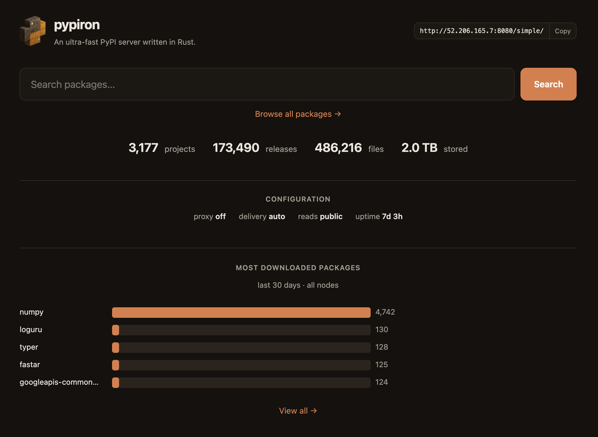

<!-- Generated from README.md by dev/scripts/readme_to_index.py — edit README.md, not this file. -->

#  pypiron

[](https://github.com/blackthorn-interstellar/pypiron/actions/workflows/ci.yml)
[](https://pypi.org/project/pypiron/)
[](https://github.com/blackthorn-interstellar/pypiron/blob/master/LICENSE)
[](https://pypiron.com/)

Host private packages and cache PyPI behind one ultra-fast index.

[Get started](#start-pypiron) · [Deploy on cloud storage](guides/standard-cloud.md)

<p align="center">
  <picture>
    <source media="(prefers-color-scheme: dark)" srcset="assets/install-throughput-dark.svg">
    
  </picture>
</p>

- **[100× faster than other self-hosted PyPI servers.](compare/index.md)** 8,288 installs/s on 2 vCPU.
- **[Blocks 72% of malicious releases by default.](security.md)**
- **Local disk, S3, GCS, and Azure.**
- **Scale without a database or coordinator.** Add nodes to one bucket.
- **[Survives a region or cloud outage.](guides/multi-region.md)**
- **[Real clients. Real clouds. All 17 million PyPI files.](testing.md)**
- **[Web dashboard with package pages and search.](assets/server-gui.png)**
- **[Health checks and Prometheus metrics built in.](concepts.md#what-it-tells-you)**

<p align="center">
  <a href="assets/server-gui.png">
    
  </a>
</p>


<a id="quickstart"></a>
<a id="getting-started"></a>

## Start pypiron

With [uv installed](https://docs.astral.sh/uv/getting-started/installation/),
replace `your-admin-password` and run:

```bash
PYPIRON_ADMIN_PASS='your-admin-password' uvx pypiron serve
```

pypiron is now running at `http://localhost:8080`. The admin username is
`admin`; the password is the one you chose.

Docker:

```bash
docker run -p 8080:8080 -e PYPIRON_ADMIN_PASS='your-admin-password' ghcr.io/blackthorn-interstellar/pypiron:latest
```

[Publish and install packages](guides/publish-install.md) ·
[Deploy on cloud storage](guides/standard-cloud.md) ·
[Migrate from another server](guides/migrate.md)

## Feature comparison

<table>
  <thead>
    <tr>
      <th align="left" colspan="2">Feature</th>
      <th>pypiron</th>
      <th>bandersnatch</th>
      <th>pypiserver</th>
      <th>pypicloud</th>
      <th>devpi</th>
      <th>proxpi</th>
    </tr>
  </thead>
  <tbody>
    <tr>
      <td colspan="2"><a href="guides/standard-cloud/">Easy setup</a></td>
      <td align="center"><abbr title="Single binary, uvx, or Docker; hosts private packages, mirror sync, and proxy from one server.">✅</abbr></td>
      <td align="center">—</td>
      <td align="center">✅</td>
      <td align="center">—</td>
      <td align="center">—</td>
      <td align="center">✅</td>
    </tr>
    <tr>
      <td colspan="2"><a href="compare/">Fast</a></td>
      <td align="center"><abbr title="8,288 installs/s on 2 vCPU in the benchmark.">✅</abbr></td>
      <td align="center"><abbr title="77 installs/s as a static nginx-served mirror — NIC-bound on the same box.">✅</abbr></td>
      <td align="center">—</td>
      <td align="center">—</td>
      <td align="center">—</td>
      <td align="center">—</td>
    </tr>
    <tr>
      <td colspan="2"><a href="concepts/#your-private-packages">Private packages</a></td>
      <td align="center"><abbr title="Publish with twine or uv; admin/uploader/reader credentials plus short-lived install tokens.">✅</abbr></td>
      <td align="center">—</td>
      <td align="center">✅</td>
      <td align="center">✅</td>
      <td align="center">✅</td>
      <td align="center">—</td>
    </tr>
    <tr>
      <td colspan="2"><a href="concepts/#public-packages">PyPI proxy</a></td>
      <td align="center"><abbr title="Caches public packages from PyPI on first install, behind the same URL as your private ones.">✅</abbr></td>
      <td align="center">—</td>
      <td align="center">—</td>
      <td align="center">✅</td>
      <td align="center">✅</td>
      <td align="center">✅</td>
    </tr>
    <tr>
      <td colspan="2"><a href="concepts/#public-packages">Sync mirror</a></td>
      <td align="center"><abbr title="Mirrors a chosen subset of upstream: include/exclude by name, wheel tags, format, size, minimum Python, and pre-release.">✅</abbr></td>
      <td align="center">✅</td>
      <td align="center">—</td>
      <td align="center">—</td>
      <td align="center">—</td>
      <td align="center">—</td>
    </tr>
    <tr>
      <td colspan="2"><a href="security/">Cooldown</a></td>
      <td align="center"><abbr title="New releases wait 7 days by default, enforced at the server for every client; upload times are preserved for client-side exclude-newer.">✅</abbr></td>
      <td align="center">—</td>
      <td align="center">—</td>
      <td align="center">—</td>
      <td align="center">—</td>
      <td align="center">—</td>
    </tr>
    <tr>
      <td colspan="2"><a href="security/">Malware blocking</a></td>
      <td align="center"><abbr title="Blocks known PyPI malware during sync and proxy fetches, in listings, and on direct downloads; on by default.">✅</abbr></td>
      <td align="center">—</td>
      <td align="center">—</td>
      <td align="center">—</td>
      <td align="center">—</td>
      <td align="center">—</td>
    </tr>
    <tr>
      <td colspan="2"><a href="security/">No dependency confusion</a></td>
      <td align="center"><abbr title="A name is yours or PyPI's, never both; a private name never falls through to upstream.">✅</abbr></td>
      <td align="center">—</td>
      <td align="center">—</td>
      <td align="center">—</td>
      <td align="center"><abbr title="Privately uploaded names block upstream mirror lookups by default.">✅</abbr></td>
      <td align="center">—</td>
    </tr>
    <tr>
      <td colspan="2"><a href="security/">Vulnerability audit</a></td>
      <td align="center"><abbr title="Lists public packages affected by known advisories, ranked by 30-day downloads.">✅</abbr></td>
      <td align="center">—</td>
      <td align="center">—</td>
      <td align="center">—</td>
      <td align="center">—</td>
      <td align="center">—</td>
    </tr>
    <tr>
      <td colspan="2"><a href="concepts/#where-packages-live">Scales, no database</a></td>
      <td align="center"><abbr title="Multi-node against S3, GCS, or Azure Blob; no database.">✅</abbr></td>
      <td align="center"><abbr title="Static mirror tree served by nginx or object storage; no database.">✅</abbr></td>
      <td align="center">—</td>
      <td align="center">—</td>
      <td align="center">—</td>
      <td align="center">—</td>
    </tr>
    <tr>
      <td colspan="2"><a href="guides/multi-region/">Multi-region failover</a></td>
      <td align="center"><abbr title="One bucket list spans regions and clouds. Uploads replicate to healthy buckets, unavailable buckets catch up when they return, and reads fail over.">✅</abbr></td>
      <td align="center">—</td>
      <td align="center">—</td>
      <td align="center">—</td>
      <td align="center"><abbr title="Master-to-replica streaming replication; each replica keeps a full copy.">✅</abbr></td>
      <td align="center">—</td>
    </tr>
    <tr>
      <td colspan="2"><a href="assets/server-gui.png">Web GUI</a></td>
      <td align="center">✅</td>
      <td align="center">—</td>
      <td align="center">—</td>
      <td align="center">✅</td>
      <td align="center">✅</td>
      <td align="center">—</td>
    </tr>
    <tr>
      <td colspan="2"><a href="concepts/#what-it-tells-you">Download stats</a></td>
      <td align="center">✅</td>
      <td align="center">—</td>
      <td align="center">—</td>
      <td align="center">—</td>
      <td align="center">—</td>
      <td align="center">—</td>
    </tr>
    <tr>
      <td rowspan="4"><a href="concepts/#where-packages-live">Storage</a></td>
      <td>Disk</td>
      <td align="center">✅</td>
      <td align="center">✅</td>
      <td align="center">✅</td>
      <td align="center">✅</td>
      <td align="center">✅</td>
      <td align="center">✅</td>
    </tr>
    <tr>
      <td>AWS S3</td>
      <td align="center"><abbr title="Plus any S3-compatible store (MinIO, R2, Ceph, …).">✅</abbr></td>
      <td align="center">✅</td>
      <td align="center">—</td>
      <td align="center">✅</td>
      <td align="center">—</td>
      <td align="center">—</td>
    </tr>
    <tr>
      <td>GCS</td>
      <td align="center">✅</td>
      <td align="center">—</td>
      <td align="center">—</td>
      <td align="center">✅</td>
      <td align="center">—</td>
      <td align="center">—</td>
    </tr>
    <tr>
      <td>Azure Blob</td>
      <td align="center">✅</td>
      <td align="center">—</td>
      <td align="center">—</td>
      <td align="center">✅</td>
      <td align="center">—</td>
      <td align="center">—</td>
    </tr>
  </tbody>
</table>

[Full comparison](https://pypiron.com/compare/)


## Security

- **[Blocks known PyPI malware.](security.md)** OSV blocking plus a release cooldown.
- **[Private names stay private.](security.md)** They never fall through to public PyPI.
- **[Control which public packages install.](concepts.md#what-it-keeps-out)** Set one approval list for every client.
- **[Air-gapped deployments.](guides/air-gapped.md)** Serve approved packages without internet access.
- **[Vulnerability audit.](security.md)** Affected public packages, ranked by downloads.

## Gauntlet testing

- **Eight real clients.** uv, pip, poetry, pdm, pipenv, hatch, flit, and twine.
- **Every PyPI file.** [All 17 million](https://github.com/blackthorn-interstellar/pypiron/blob/master/src/corpus_check.rs), checked against ground truth.
- **Killed mid-write.** Crash sweeps, fleet chaos, and hostile upstreams.
- **Fuzzed nightly. Simulated and model-checked.**
- **Security-audited by frontier models.** The same models that built it.

[See the full testing gauntlet.](testing.md)

## Going further

- [Publish and install](guides/publish-install.md) — private packages and the PyPI cache
- [Deploy on cloud storage](guides/standard-cloud.md) — S3, GCS, or Azure
- [Migrate](guides/migrate.md) — move from pypicloud, devpi, Artifactory, or Nexus
- [How pypiron works](concepts.md) — storage, caching, access, and recovery
- [Configuration](reference/configuration.md) — every flag and its `PYPIRON_*` env var
- [Compare servers](compare/index.md) — benchmarks and when to choose something else
- [For AI agents](for-agents.md) — decide, configure, and verify

## Contributing — [Humans Need Not Apply](https://www.youtube.com/watch?v=7Pq-S557XQU)

pypiron was built by AI coding agents from Anthropic, OpenAI, SpaceXAI, and Moonshot — and that's how it stays. All development is done by AI coders, for security and consistency: human-developed code is a security risk, and we don't accept it. Humans are welcome to open issues and contribute documentation.

## License

MIT — see [LICENSE](https://github.com/blackthorn-interstellar/pypiron/blob/master/LICENSE).
